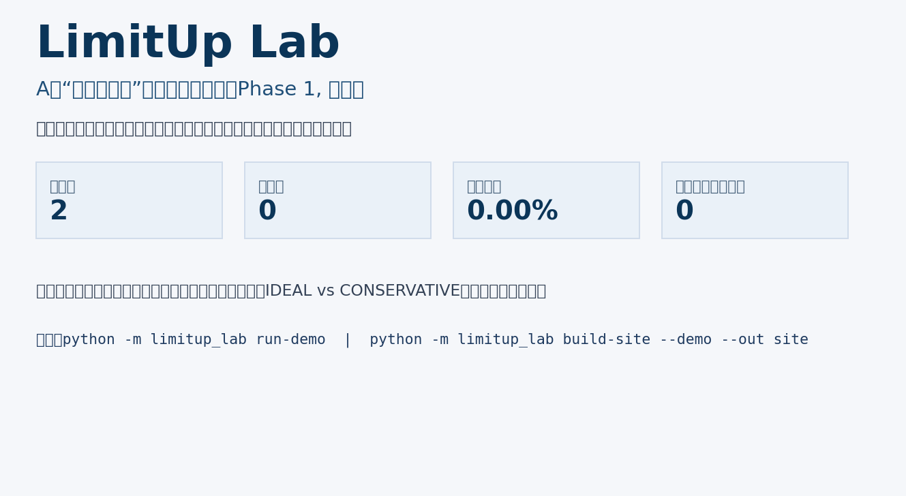
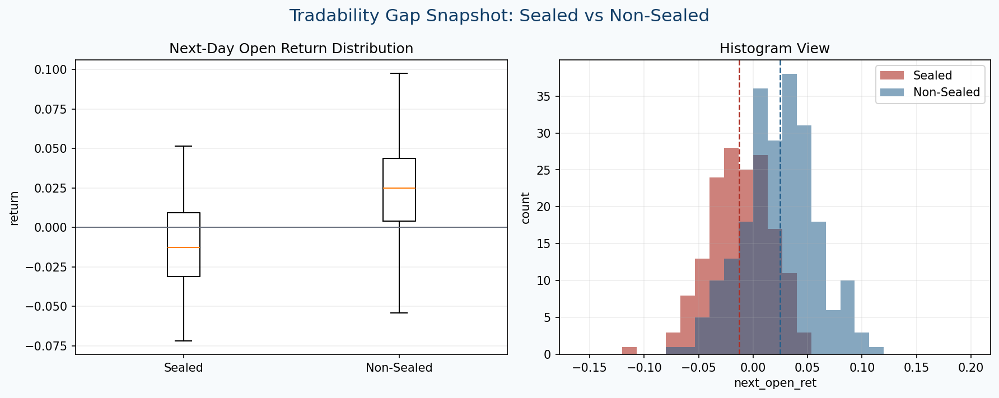
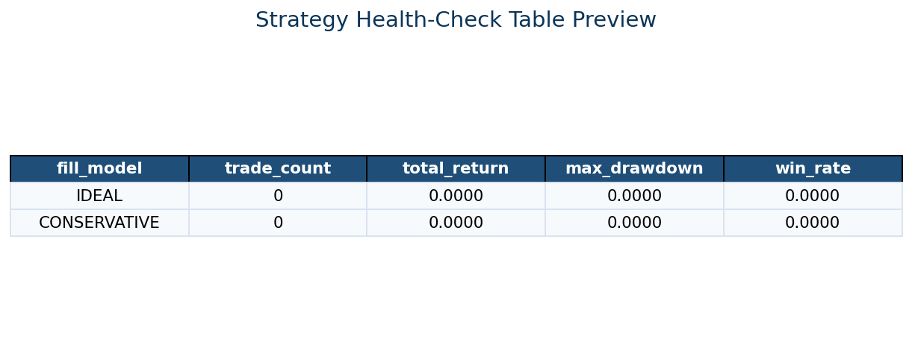
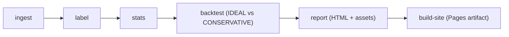

# limitup-lab

日频视角拆解 A 股涨停板生态，并用可成交性假设体检策略结论，减少“回测能做、实盘做不到”的错觉。

[Live Demo (GitHub Pages)](https://constantine-s-an.github.io/A-/)

## Screenshots





## Features

- Canonical schema + ingest pipeline (`CSV/Parquet -> canonical parquet`)
- 日频标签体系：`limit_up`, `one_word`, `opened`, `sealed`, `streak_up`
- 策略体检：`IDEAL` vs `CONSERVATIVE` 两种 fill 假设并行比较
- 敏感性分析：收益、回撤、胜率、可买入样本损失对比
- 自动研报：HTML + PNG fallback + 交互图表 + 可导出 CSV
- 一键静态站点产物：`build-site` 输出 `site/`，可直接发布到 Pages

## Architecture



## One-Command Demo

生成 demo 报告：

```bash
python -m limitup_lab run-demo
```

生成可发布站点：

```bash
python -m limitup_lab build-site --demo --out site
```

## Limitations & Roadmap

当前限制（Phase 1）：
- 仅日频近似，无法刻画盘中开板/回封节奏
- 无分钟线与 L2 封单质量数据，无法评估真实排撤单竞争
- 对制度变迁（涨跌幅规则、特殊时段政策）仅做静态配置，未做分阶段回放

Roadmap：
- 引入分钟线标签（首封时点、开板次数、回封强度）
- 引入 L2/逐笔特征（封单金额、撤单率、成交穿透）
- 制度变迁分段回测（按日期生效规则自动切换）
- 增加多策略组合与更细致的成交价格模型
