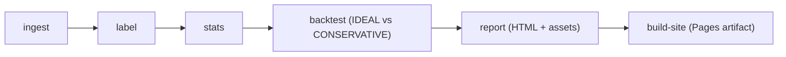

# limitup-lab

Formal research toolkit for A-share limit-up ecosystem analysis and strategy health-checking (Phase 1, daily frequency).

[Live Demo (GitHub Pages)](https://constantine-s-an.github.io/A-/)

## Project Objective

`limitup-lab` is designed to answer a practical question in quantitative research:

How much of the observed limit-up premium remains after realistic tradability constraints are applied?

The project standardizes data ingestion, computes a reproducible label system, and compares strategy outcomes under alternative fill assumptions to expose potential backtest optimism.

## Screenshots


## Features

- Canonical schema + ingest pipeline (`CSV/Parquet -> canonical parquet`)
- Real market data integration via `fetch-akshare` (A-share daily bars by `ts_code`)
- Daily label system: `limit_up`, `one_word`, `opened`, `sealed`, `streak_up`
- Tradability health-check: `IDEAL` vs `CONSERVATIVE` fill assumptions
- Sensitivity analysis for return, drawdown, win rate, and trade loss due to execution constraints
- Automated report generation: HTML + PNG fallback + interactive charts + CSV exports
- Static site packaging for GitHub Pages via `build-site`

## Methodology

1. Standardize raw bars and instrument metadata into canonical schemas.
2. Compute exchange-rule-aware limit prices and limit-up state labels.
3. Build streak and next-day return distributions by grouped conditions.
4. Run `backtest` under multiple fill models to quantify execution realism.
5. Publish report and site artifacts for review and auditability.

## Architecture



## One-Command Demo

Generate a full demo report:

```bash
python -m limitup_lab run-demo
```

Build a deployable Pages artifact:

```bash
python -m limitup_lab build-site --demo --out site
```

## Real Data Example

Fetch real A-share daily bars and generate a report:

```bash
python -m pip install akshare
python -m limitup_lab fetch-akshare \
  --symbols 002261.SZ,603598.SH,000957.SZ \
  --start 20240101 \
  --end 20240630 \
  --out data/processed/real_case_2024h1
python -m limitup_lab report \
  --data data/processed/real_case_2024h1 \
  --out reports/real_case_2024h1
```

Detailed walkthrough: `docs/real_data_example.md`

## CLI Reference

- `ingest`: normalize local daily/instrument files and write parquet
- `fetch-akshare`: pull real A-share daily bars from AkShare
- `label`: compute phase-1 daily limit-up ecosystem labels
- `stats`: aggregate baseline ecosystem statistics
- `report`: generate research report from processed parquet
- `run-demo`: execute fixture-based end-to-end demo
- `export-pdf`: export report HTML to PDF with zip fallback
- `build-site`: build deployable static site artifact

## Limitations & Roadmap

Current scope (Phase 1):
- Daily-frequency approximation only; intraday dynamics are not modeled.
- No 分钟线 / L2 order-book microstructure, so queueing and order competition are approximated.
- Rule changes across market regimes (制度变迁) are configuration-driven, not yet fully segmented in simulation.

Roadmap:
- Add 分钟线 labels (first seal timestamp, reopen count, reseal quality).
- Add L2/transaction-level signals (order-book depth, cancel intensity, execution pressure).
- Add regime-aware rule switching for制度变迁 period backtests.
- Extend to multi-strategy portfolio-level diagnostics and richer fill price models.

## Compliance Note

This project is for research and diagnostic analysis only. It does not implement live trading execution logic and should not be interpreted as investment advice.
