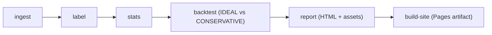

# limitup-lab

[Live Demo (GitHub Pages)](https://constantine-s-an.github.io/A-/)

## English

Formal research toolkit for A-share limit-up ecosystem analysis and strategy health-checking (Phase 1, daily frequency).

## Project Objective

`limitup-lab` is designed to answer a practical execution-realism question:

How much of the observed limit-up premium remains after tradability constraints are applied?

The toolkit standardizes input data, computes reproducible labels, and compares strategy outcomes under alternative fill assumptions to reduce backtest optimism.

## Screenshots


## Features

- Canonical schema + ingest pipeline (`CSV/Parquet -> canonical parquet`)
- Real market data integration via `fetch-akshare` (A-share daily bars by `ts_code`)
- Daily label system: `limit_up`, `one_word`, `opened`, `sealed`, `streak_up`
- Tradability health-check: `IDEAL` vs `CONSERVATIVE` fill assumptions
- Sensitivity analysis for return, drawdown, win rate, and trade loss due to execution constraints
- Automated report generation: HTML + PNG fallback + interactive charts + CSV exports
- Static site packaging for GitHub Pages via `build-site`

## Methodology

1. Standardize raw bars and instrument metadata into canonical schemas.
2. Compute exchange-rule-aware limit prices and limit-up state labels.
3. Build streak and next-day return distributions by grouped conditions.
4. Run `backtest` under multiple fill models to quantify execution realism.
5. Publish report and site artifacts for review and auditability.

## Architecture



## One-Command Demo

Generate a full demo report:

```bash
python -m limitup_lab run-demo
```

Build a deployable Pages artifact:

```bash
python -m limitup_lab build-site --demo --out site
```

## Real Data Example

Fetch real A-share daily bars and generate a report:

```bash
python -m pip install akshare
python -m limitup_lab fetch-akshare \
  --symbols 002261.SZ,603598.SH,000957.SZ \
  --start 20240101 \
  --end 20240630 \
  --out data/processed/real_case_2024h1
python -m limitup_lab report \
  --data data/processed/real_case_2024h1 \
  --out reports/real_case_2024h1
```

Detailed walkthrough: `docs/real_data_example.md`

## CLI Reference

- `ingest`: normalize local daily/instrument files and write parquet
- `fetch-akshare`: pull real A-share daily bars from AkShare
- `label`: compute phase-1 daily limit-up ecosystem labels
- `stats`: aggregate baseline ecosystem statistics
- `report`: generate research report from processed parquet
- `run-demo`: execute fixture-based end-to-end demo
- `export-pdf`: export report HTML to PDF with zip fallback
- `build-site`: build deployable static site artifact

## Limitations & Roadmap

Current scope (Phase 1):
- Daily-frequency approximation only; intraday dynamics are not modeled.
- No 分钟线 / L2 order-book microstructure, so queueing and order competition are approximated.
- Rule changes across market regimes (制度变迁) are configuration-driven, not yet fully segmented in simulation.

Roadmap:
- Add 分钟线 labels (first seal timestamp, reopen count, reseal quality).
- Add L2/transaction-level signals (order-book depth, cancel intensity, execution pressure).
- Add regime-aware rule switching for制度变迁 period backtests.
- Extend to multi-strategy portfolio-level diagnostics and richer fill price models.

## Compliance Note

This project is for research and diagnostic analysis only. It does not implement live trading execution logic and should not be interpreted as investment advice.

---

## 中文版

面向 A 股涨停板生态研究与策略体检的正式化工具包（Phase 1，日频）。

## 项目目标

`limitup-lab` 聚焦一个关键研究问题：

当考虑真实可成交性约束后，涨停相关超额收益还能保留多少？

本项目通过标准化数据输入、可复现标签体系与多成交假设对比，帮助识别“回测可得、实盘难得”的收益幻觉。

## 核心能力

- 规范化数据输入与 canonical schema（`CSV/Parquet -> canonical parquet`）
- 真实数据接入：`fetch-akshare`（按 `ts_code` 拉取 A 股日线）
- 日频标签体系：`limit_up`、`one_word`、`opened`、`sealed`、`streak_up`
- 可交易性体检：`IDEAL` 与 `CONSERVATIVE` 成交假设并行评估
- 敏感性分析：收益、回撤、胜率、可买入样本损失
- 报告自动化：HTML、PNG fallback、交互图、CSV 导出
- 站点化发布：`build-site` 产出 GitHub Pages 可部署目录

## 研究流程

1. 将原始日线与标的信息标准化为 canonical schema。
2. 根据规则计算涨跌停价并生成日频生态标签。
3. 统计连板结构与次日收益分布。
4. 在不同 fill 假设下运行 `backtest` 对比收益稳健性。
5. 输出研报与静态站点产物，支持审阅与归档。

## 一键示例

生成 demo 报告：

```bash
python -m limitup_lab run-demo
```

生成可部署站点：

```bash
python -m limitup_lab build-site --demo --out site
```

## 真实数据示例

```bash
python -m pip install akshare
python -m limitup_lab fetch-akshare \
  --symbols 002261.SZ,603598.SH,000957.SZ \
  --start 20240101 \
  --end 20240630 \
  --out data/processed/real_case_2024h1
python -m limitup_lab report \
  --data data/processed/real_case_2024h1 \
  --out reports/real_case_2024h1
```

详细说明见 `docs/real_data_example.md`。

## 使用边界与路线图

当前边界（Phase 1）：
- 仅支持日频近似，无法刻画完整盘中开板/回封节奏。
- 缺少分钟线与 L2 微观结构，排队成交与撤单竞争采用近似处理。
- 制度变迁目前为配置驱动，尚未完成全量分阶段模拟。

后续路线图：
- 引入分钟线标签（首封时点、开板次数、回封质量）。
- 引入 L2 / 逐笔特征（封单深度、撤单强度、成交压力）。
- 增加按制度变迁自动分段回测。
- 扩展到多策略组合与更细粒度成交价格模型。

## 合规说明

本项目仅用于研究与体检分析，不包含实盘交易执行逻辑，亦不构成任何投资建议。
